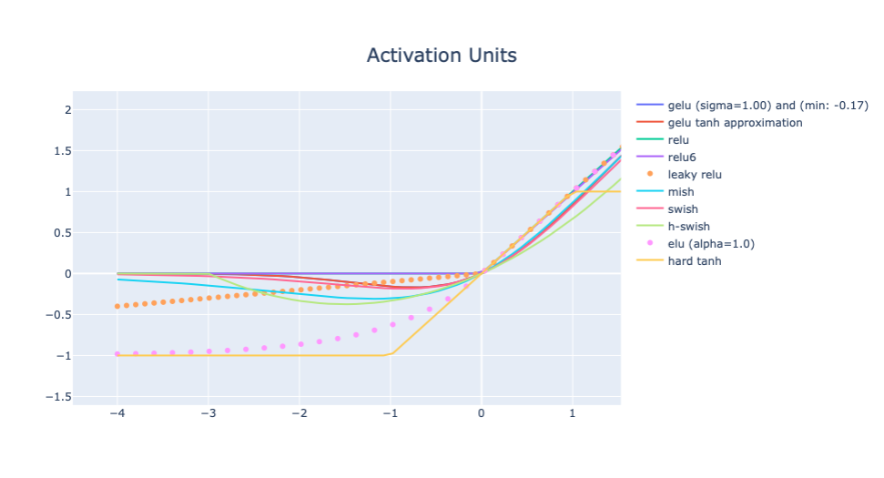

## Jupyter notebook to display activation units

1. ReLU: Rectifier Linear Unit `max(0, x)`
2. ReLu6: Rectifier Linear Unit Cropped at 6 `min(max(0, x), 6)`
3. LReLU: Leaky ReLU `x >= 0 ? x : a * x` (`a` can be picked randomly in [1/8, 1/3]) [paper](https://arxiv.org/pdf/1505.00853.pdf)
4. ELU: Exponential Linear Unit `max(0,x) + min(0, alpha (exp(x) - 1))`
5. GELU: Gaussian Error Linear Unit
6. MISH: Self-Regularized Non-Monotonic Activation [Paper](https://arxiv.org/pdf/1908.08681.pdf)
7. SWISH: `x * sigmoid(x)` {Used in MobileNet but slow, use h-swish intead}
8. Hard-SWISH: `x (ReLu6(x+3)/6` (https://arxiv.org/pdf/1908.08681.pdf)
9. Hard Tanh: `max(-1, min(1, x))`

```jupyter notebook```
## Launching notepad server

